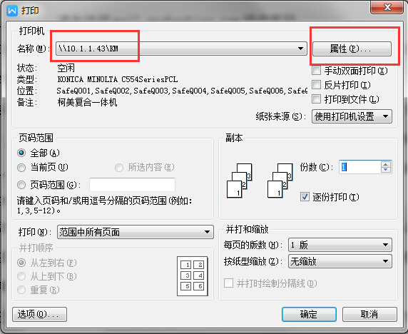
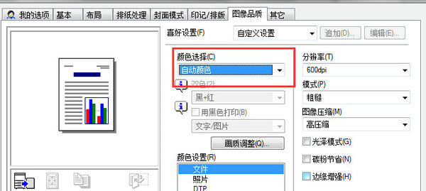
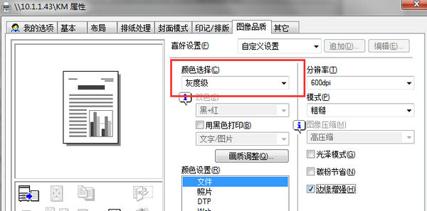

# 彩色打印功能设置

> 注：需要使用彩色打印效果的同事，可以走流程“计算机系统权限/密码更改申请”，申请开通KM（打印复合一体机）彩色打印权限。
如打印文稿，需要使用彩色打印时，请对打印机属性进行相关设置。步骤如下：

1、点击打印按钮，选择“\\10.1.1.43\KM”后，进入“属性”；

 
2、在“图像品质”中，选择“自然颜色”。注意，如果是不需要使用彩色打印，为节省资源，请选择“灰度级”。
 

